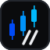

# TERMINAL//IN

**An agentic algorithmic trading terminal for Indian markets (NSE).** Runs entirely on a single machine — Python, SQLite, and a statically served Next.js interface — with a local language model embedded in the trade-decision loop. No cloud dependencies.

> Paper-trading first; live execution via Zerodha Kite Connect when enabled. The system operates exclusively on real market data and observes real NSE market hours, products (MIS/CNC), and settlement mechanics — including in simulation.

---

## Modules

| Module | Route | What it does |
|--------|-------|--------------|
| **MARKET** | `/` | Live watchlist (72 NSE instruments), candlestick charts, news + FinBERT sentiment, global context (indices/FX/commodities), economic calendar |
| **EQUITIES** | `/trade` | Cash cockpit: **portfolio statement** (composition, holdings with live marks, MIS/CNC products), positions book, order ticket, trade history, P&L attribution, equity curve |
| **F&O** | `/fno` | Derivatives module: COCKPIT (index complex NIFTY/BANKNIFTY/FINNIFTY + lot sizes, India VIX, index signals) and **OPTION CHAIN** (per-strike premiums + greeks, expiry/strike, lot-based paper execution). Premiums are Black-Scholes theoretical (real spot + India VIX); rigorous SPAN margin gate is the next stage (see PRD) |
| **AGENTS** | `/agents` | The agentic core: actionable-only scan view, **LLM Trade Planner verdicts with reasoning**, supervisor control loop, decision log with hindsight, EventBus inspector, **streaming app-aware AI analyst** |
| **TRAIN** | `/train` | **Recursive model training**: rebuild dataset from the system's own trades + judged decisions → LoRA fine-tune → loss metrics → run history |
| **BACKTEST** | `/backtest` | **Walk-forward backtest** over 10y real OHLCV through the deterministic decision core (no lookahead): equity curve, per-lens/per-regime attribution, walk-forward-by-year, closed trades |

## The agentic decision flow

```
                       6 deterministic lenses (S2 52w · S4 RSI · S5 EMA · S8 VIX · MOM · NEWS)
                                        │  every 120s, all 72 symbols
                                        ▼
                       noise reduction (signal_filters.py)
                       ├─ data-quality gate (no thin/stale history)
                       ├─ persistence ≥ 2 consecutive scans (debounce)
                       ├─ confidence EMA smoothing
                       └─ EV hysteresis (enter ≥1.2, exit <1.0) + regime hysteresis
                                        │  top-5 eligible candidates
                                        ▼
                       TRADE PLANNER — local LLM judge (Ollama)
                       one structured-JSON call per scan: approve / reject / size
                       + decision memory context ("your last 10 calls and how they aged")
                       Ollama down → STRICTER deterministic bar, flagged amber, never silent
                                        │  approved signals
                                        ▼
                       M2 RISK GATE — 13 deterministic checks (planner can veto, never bypass)
                                        │
                                        ▼
                       broker (paper fill sim / Kite REST) → settlement → P&L
                                        │
        ┌───────────────────────────────┼────────────────────────────────┐
        ▼                               ▼                                ▼
  StrategyLearner               TradingSupervisor                DecisionMemory
  slow loop: Bayesian WR,       fast loop: lens breaker          hindsight loop: did rejected
  thresholds per 15 trades      (3 losses → 2h off), throttle,   signals win? feeds back into
                                kill-switch at 8 losses          the next planner prompt
        └───────────────────────────────┼────────────────────────────────┘
                                        ▼
                       TRAIN: recursive LoRA fine-tune on the system's own record
```

Three feedback loops at three speeds — trade-by-trade control (supervisor), batch parameter tuning (learner), and model retraining (TRAIN module). Every decision is persisted and explainable: the DECISION LOG answers *"why didn't you take that trade, and was it right?"*

## What's under the hood

- **Strategy engine** — 8 rule strategies (ORB, 52-week breakout, RSI reversion, EMA pullback, pairs cointegration, VIX fade, Hawkes momentum) evaluated every 60s
- **Regime classifier** — 6-state HMM (heuristic fallback until trained; degraded mode reported, never hidden)
- **DSA** — monthly capital allocation across strategies: `0.40×regime_fit + 0.30×Bayesian_WR + 0.30×Sharpe`
- **Risk** — 13-check pre-trade gate, sector concentration via full-universe sector map, drawdown/daily-loss caps, kill switch, margin check that *rejects* unpriceable orders
- **Data** — real NSE OHLCV via yfinance (730d daily + 60d 5m, gap-aware backfill, 24h refresh), live quotes, FinBERT news sentiment
- **Health** — `/api/health` reports every degraded subsystem; the UI badges them. No silent fallbacks anywhere in the signal path.
- **Design system** — layered cool-dark surfaces under an embossed dot-matrix mesh (cursor acts as a soft lamp; the grid never moves), frosted-glass chrome, electric-blue accent ramp (gold strictly = warning), Geist Mono for data / Georgia for display. Single palette source: `terminal_ui/lib/theme.ts` + `styles/globals.css`.

## Quick start

```powershell
# One-time setup
.\start.ps1                       # creates venv, installs deps, starts everything
.\setup_ollama.ps1                # local LLM for the Trade Planner (~2 GB, one-time)

# Packaged single-process mode (UI + API on :5000, no Node required)
cd terminal_ui ; $env:BUILD_STATIC='1' ; npx next build ; cd ..
.\background.ps1 -Start           # headless; -Install registers auto-start at logon

# Development mode (hot reload)
.venv\Scripts\python.exe -m terminal_in.main          # API :5000
cd terminal_ui ; npm run dev                          # UI :3000

# Build the shipped desktop app + Windows installer (static UI → onedir → Inno Setup)
.\packaging\build_installer.ps1                       # → dist\TERMINAL-IN-Setup.exe
#   (or just the onedir exe: .venv\Scripts\pyinstaller packaging\terminal_in.spec --noconfirm)
#   first launch runs an onboarding wizard (capital / risk tier / mode / keys)

# Tests
.venv\Scripts\pytest tests\ -v                        # 191 tests
```

**Dev vs shipped:** in development the backend serves on `localhost:5000` and you use a browser — convenient for iteration. The **packaged `.exe` is a self-serving desktop app**: it runs the backend on a private loopback port and hosts the UI in a native `TERMINAL//IN` window (WebView2), so there is no browser and no visible URL. Hardware maximization (`hw.apply()` — all logical cores) runs in both.

Operator guide: [docs/USAGE.md](docs/USAGE.md) · Product specification: [docs/PRD.md](docs/PRD.md) · Legal & privacy: [docs/LEGAL.md](docs/LEGAL.md)

`.env` keys: `MODE=paper|live`, `KITE_API_KEY/SECRET/ACCESS_TOKEN`, `NEWSAPI_KEY`, `INITIAL_CAPITAL`, `MAX_DD_PCT`, `DAILY_LOSS_CAP_PCT`, `OLLAMA_HOST`, `OLLAMA_MODEL`, `PLANNER_ENABLED`.

## Recursive training (TRAIN module)

Each run: rebuild the SFT dataset (financial corpora **+ the system's own closed trades + hindsight-judged planner decisions**) → LoRA fine-tune the base SLM (**Qwen2.5-1.5B-Instruct** locally — fits 16 GB fp32 with gradient checkpointing; 3B+ on a cloud GPU) in an isolated subprocess → record the real loss curve per run, surfaced live on the `/train` cockpit. Deploy path: merge adapter → GGUF → `ollama create` → **eval-gate** (42-item set; must beat the incumbent) before it replaces the planner/analyst.

## Latency posture (and the honest limits)

This is a **120-second-cadence positional system trading through a broker REST API** — not HFT. End-to-end signal latency is dominated by data-source polling (seconds) and broker round-trips (~100–300 ms), not by the process. What we do anyway:

- In-process EventBus (function-call dispatch, no broker hop, no serialization on the hot path)
- Vectorized indicator math (numpy) across the 72-symbol scan
- Optional **Python 3.14 JIT** (`PYTHON_JIT=1`) and **high process priority** (`LOW_LATENCY=1`)
- SQLite WAL + hot caches so reads never block the tick path

What we deliberately *don't* do on a retail laptop — kernel bypass (DPDK/Solarflare), FPGA NICs, exchange colocation — and what the realistic upgrade path is instead (Kite WebSocket ticks in live mode, a VPS near the exchange, C-extension hot loops) is laid out in [docs/PRD.md](docs/PRD.md#low-latency-roadmap).

## Legal

TERMINAL//IN is a personal analysis and automation tool — **not investment advice**. It is local-first: no telemetry, no cloud, no account system; trades, keys, and models never leave the machine. Ownership, the trading disclaimer, privacy details, and third-party licenses are in [docs/LEGAL.md](docs/LEGAL.md).

## Roadmap (detail in [docs/PRD.md](docs/PRD.md))

- **P2** — F&O execution: ✅ option chain + lot-based paper fills + expiry square-off + SPAN-approx margin + **portfolio greek caps & event-day limits** shipped; live-mode Kite chain ingestion remains
- **P2** — Backtest engine: ✅ shipped — walk-forward over 10y real OHLCV through the decision core, equity curve + attribution on `/backtest`
- **P3** — Multi-asset: NSE CDS currency futures (USDINR), MCX commodities (gold/crude), then global venues
- **P3** — Options strategies as first-class multi-leg positions (spreads, condors, greeks)

## Project layout

```
terminal_in/            Python backend (threads + EventBus)
  agents/               orchestrator, trade_planner (LLM judge), supervisor,
                        decision_memory, signal_filters, learner, training/
  strategy_engine/      8 strategies, regime HMM, DSA
  risk/                 M2 gate, M3 analyst, event calendar
  execution/            paper broker, F&O paper broker, options pricing, Kite broker, EOD settlement
  backtest/             walk-forward engine (real OHLCV replay, no lookahead)
  data_ingest/          yfinance backfill + live feed, instrument registry (72 symbols), F&O contracts
  news/                 NewsAPI + FinBERT
  api/                  Flask + SocketIO (threading mode), route blueprints
terminal_ui/            Next.js 14 — MARKET / EQUITIES / F&O / AGENTS / TRAIN / BACKTEST
tests/                  191 tests (gate, broker, persistence, filters, planner, supervisor, backtest, F&O greeks, palette, onboarding)
docs/PRD.md             Product requirements + multi-asset and low-latency roadmaps
```

---

*Single user, single laptop, ₹10L paper capital, NSE market hours. Built with Claude Code.*
