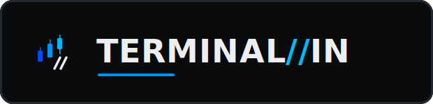
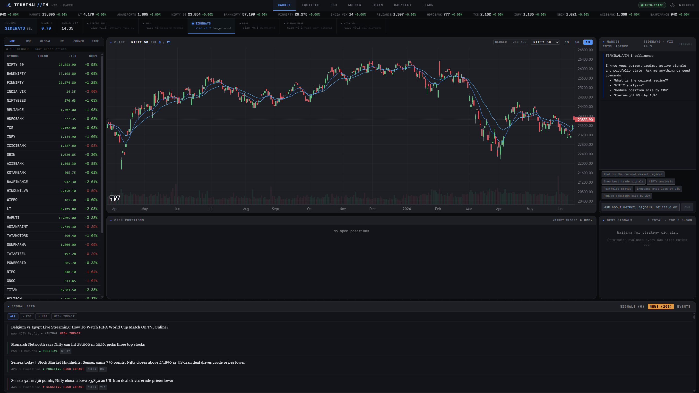
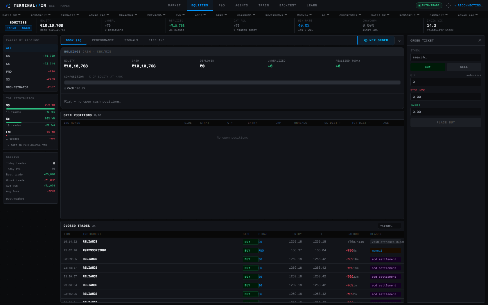
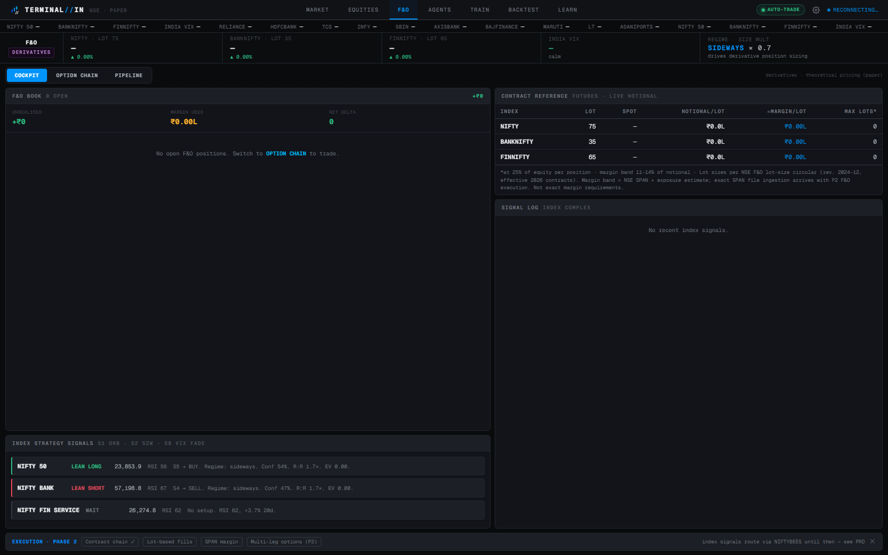
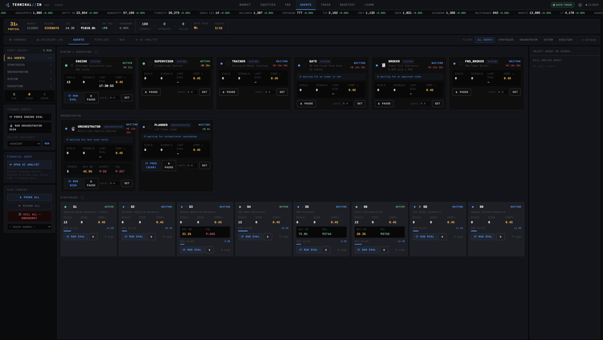
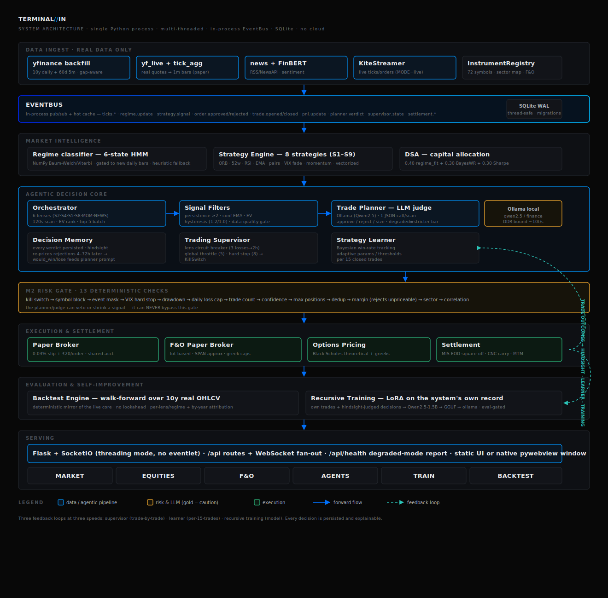

<div align="center">



<br/>


**An agentic algorithmic trading terminal for Indian markets (NSE)** — a single-machine stack
(Python · SQLite · statically served Next.js) with a local language model embedded in the
trade-decision loop, and a falsification-first backtest harness that refuses to ship an edge
it cannot prove. No cloud dependencies.

</div>

> Paper-trading first; live execution via Zerodha Kite Connect when enabled. The system operates exclusively on real market data and observes real NSE market hours, products (MIS/CNC), and settlement mechanics — including in simulation.

---

## Positioning

This is a **research and execution terminal**, not an alpha engine — and it says so on the strength of its own evidence. A built-in falsification harness (`backtest/validation.py`) tests every claimed edge out-of-sample, net of real Indian transaction costs, with walk-forward fences and multiple-testing corrections. The honest result, recorded in [`docs/ALPHA_FINDINGS.md`](docs/ALPHA_FINDINGS.md): **no long-only configuration in the large-cap universe beats buy-and-hold NIFTY net of costs** — nine independent, walk-forward-fenced negatives, including a learned forward-EV head, an LLM planner, an event/PEAD plane, and an F&O variance-premium harvester. One genuine open lead survives: a fundable long-only momentum tilt on the wider mid-cap universe that beats equal-weight on a risk-adjusted basis — pending a point-in-time survivorship correction before it can be trusted.

What this terminal actually delivers is **engineering you can trust**: a single-process, fully-local stack (no cloud, no Redis, no Docker); real-data-only ingestion with explicit degraded-mode surfacing; a 17-check pre-trade risk gate; product-aware paper settlement; a shared, audited Indian transaction-cost model; and an agentic decision loop with a local LLM judge that can veto or shrink — but never bypass — the risk gate. The value is the cockpit, the plumbing, the cost honesty, and a validation discipline that refuses to tune signals until they pass.

If alpha is the goal, the evidence points at **inputs, not models**: orthogonal, point-in-time forward information (real fundamentals, estimate revisions, relational/supply-chain structure) that no free source provides for this universe today. That is a data-acquisition problem, and it is the roadmap — not a bigger model.

---

## Screens

> A Bloomberg-style dense terminal: layered cool-dark surfaces over an embossed dot-matrix mesh, frosted-glass chrome, electric-blue accent ramp. Captures are paper mode, NSE closed (last-close marks).

### MARKET — `/`
Watchlist (72 NSE instruments + indices/FX/commodities/risk tabs), live candlestick chart, regime strip, streaming AI market-intelligence panel, full-width signal feed.



### EQUITIES — `/trade`
Cash cockpit: portfolio statement (composition + holdings with live marks), positions book, order ticket, P&L attribution, and closed-trades history.



### F&O — `/fno`
Derivatives: COCKPIT (book + greeks, index complex with lot sizes, India VIX, index strategy signals) and OPTION CHAIN (per-strike Black-Scholes premiums + greeks, lot-based paper execution).



### AGENTS — `/agents`
The agentic core: actionable-only scan matrix, LLM Trade Planner verdicts with reasoning, supervisor control loop, decision log with hindsight, and the streaming app-aware AI analyst.



---

## Modules

| Module | Route | What it does |
|--------|-------|--------------|
| **MARKET** | `/` | Live watchlist (72 NSE instruments), candlestick charts, news + FinBERT sentiment, global context (indices/FX/commodities), economic calendar |
| **EQUITIES** | `/trade` | Cash cockpit: **portfolio statement** (composition, holdings with live marks, MIS/CNC products), positions book, order ticket, trade history, P&L attribution, equity curve |
| **F&O** | `/fno` | Derivatives module: COCKPIT (index complex NIFTY/BANKNIFTY/FINNIFTY + lot sizes, India VIX, index signals) and **OPTION CHAIN** (per-strike premiums + greeks, expiry/strike, lot-based paper execution). Paper premiums are Black-Scholes theoretical (real spot + India VIX); in live mode the **real Kite chain** (LTP/OI/volume, IV implied from LTP) is served. **SPAN-approx margin + portfolio greek caps + event-day limits** shipped |
| **AGENTS** | `/agents` | The agentic core: actionable-only scan view, **LLM Trade Planner verdicts with reasoning**, supervisor control loop, decision log with hindsight, EventBus inspector, **streaming app-aware AI analyst** |
| **TRAIN** | `/train` | **Recursive model training**: rebuild dataset from the system's own trades + judged decisions → LoRA fine-tune → loss metrics → run history |
| **BACKTEST** | `/backtest` | **Walk-forward backtest** over 10y real OHLCV (no lookahead): replays the live core with the **real Trade Planner in the loop** (degraded *or* sampled LLM, with a per-judge comparison) or the **real strategy_engine classes** (SOURCE toggle); equity curve, per-lens/per-regime/by-year attribution, progress bar + cancel |

### What's shipped vs researched vs planned

The six modules above are all **✅ shipped**. To set expectations honestly, the
deeper layers fall into three buckets:

- **✅ Shipped & live** — the six modules, the 17-check risk gate, paper + (Kite)
  live execution, F&O paper execution with SPAN-approx margin, the recursive
  training pipeline, and the walk-forward backtest + alpha-validation harness.
- **🔬 Built, evaluated, and *not promoted*** — Module 6's forward judge (directional
  competence, a LightGBM forward-EV head), the point-in-time event/PEAD plane, and a
  VIX-conditioned reaction matrix. All were built and **failed their walk-forward
  eval gate**, so they stay behind flags, never live. The negatives are documented in
  [`docs/ALPHA_FINDINGS.md`](docs/ALPHA_FINDINGS.md) — this project keeps its dead ends
  on the record rather than hiding them.
- **🛣️ Roadmap** — full agentic-stack replay in the backtest, multi-asset (NSE CDS FX →
  MCX commodities → global), multi-leg options strategies, the Firm Intelligence Graph,
  and the rest of the Module 6 world-model track (see `docs/PRD.md`, `docs/WORLD_MODEL.md`).

## Architecture

A single multi-threaded Python process. Every component communicates through the in-process `EventBus` — no Redis, no Docker, no message broker. Real market data flows in at the top; trade outcomes flow back as three feedback loops at three speeds (supervisor → learner → recursive training).



## The agentic decision flow

```
                       6 deterministic lenses (S2 52w · S4 RSI · S5 EMA · S8 VIX · MOM · NEWS)
                                        │  every 120s, all 72 symbols
                                        ▼
                       noise reduction (signal_filters.py)
                       ├─ data-quality gate (no thin/stale history)
                       ├─ persistence ≥ 2 consecutive scans (debounce)
                       ├─ confidence EMA smoothing
                       └─ EV hysteresis (enter ≥1.2, exit <1.0) + regime hysteresis
                                        │  top-5 eligible candidates
                                        ▼
                       TRADE PLANNER — local LLM judge (Ollama)
                       one structured-JSON call per scan: approve / reject / size
                       + decision memory context ("your last 10 calls and how they aged")
                       Ollama down → STRICTER deterministic bar, flagged amber, never silent
                                        │  approved signals
                                        ▼
                       M2 RISK GATE — 17 deterministic checks (planner can veto, never bypass)
                                        │
                                        ▼
                       broker (paper fill sim / Kite REST) → settlement → P&L
                                        │
        ┌───────────────────────────────┼────────────────────────────────┐
        ▼                               ▼                                ▼
  StrategyLearner               TradingSupervisor                DecisionMemory
  slow loop: Bayesian WR,       fast loop: lens breaker          hindsight loop: did rejected
  thresholds per 15 trades      (3 losses → 2h off), throttle,   signals win? feeds back into
                                kill-switch at 8 losses          the next planner prompt
        └───────────────────────────────┼────────────────────────────────┘
                                        ▼
                       TRAIN: recursive LoRA fine-tune on the system's own record
```

Three feedback loops at three speeds — trade-by-trade control (supervisor), batch parameter tuning (learner), and model retraining (TRAIN module). Every decision is persisted and explainable: the DECISION LOG answers *"why didn't you take that trade, and was it right?"*

## What's under the hood

- **Strategy engine** — 8 rule strategies (ORB, 52-week breakout, RSI reversion, EMA pullback, pairs relative-value, VIX fade, Hawkes momentum) evaluated every 60s; pairs (S6) is single-leg relative-value today (true two-leg hedge is roadmap). Cash shorts are intraday-only (MIS) — no overnight CNC short, per NSE
- **Regime classifier** — 6-state HMM (heuristic fallback until trained; degraded mode reported, never hidden)
- **DSA** — monthly capital allocation across strategies: `0.40×regime_fit + 0.30×Bayesian_WR + 0.30×Sharpe`
- **Risk** — 17-check pre-trade gate (+ a non-blocking VIX size-reduce), sector concentration via full-universe sector map (with a small-book floor — see below), drawdown/daily-loss caps, kill switch, margin check that *rejects* unpriceable orders
- **Data** — real NSE OHLCV via yfinance (~10y daily back to 2016 + 60d 5m, gap-aware forward + backward backfill, 24h refresh), live quotes, and FinBERT news sentiment corrected by an India-context macro layer (a weaker rupee or a fuel-price drop carry the correct broad-market sign, where generic sentiment reads them backwards)
- **Firm knowledge** — a vector-less, point-in-time RAG (SQLite FTS5/BM25, no embeddings) over real firm filings, announcements, and news on a rolling five-year horizon; grounds the AI analyst with citation-tagged context and is the substrate for orthogonal, fundamentals-driven signals
- **Health** — `/api/health` reports every degraded subsystem; the UI badges them. No silent fallbacks anywhere in the signal path.
- **Design system** — layered cool-dark surfaces under an embossed dot-matrix mesh (cursor acts as a soft lamp; the grid never moves), frosted-glass chrome, electric-blue accent ramp (gold strictly = warning), Geist Mono for data / Georgia for display. Single palette source: `terminal_ui/lib/theme.ts` + `styles/globals.css`.

## Does it actually capture alpha? (honest answer)

**Not as a stock-picker — and we can prove it, which is the point.** A falsification-first
validation harness (`terminal_in/backtest/validation.py`) runs the full stack over 10y of
real OHLCV, net of the full Indian cost stack (`execution/costs.py`), against three
benchmarks (buy-hold NIFTY, equal-weight, a 1,000× random-symbol null) with
multiple-testing correction (Deflated Sharpe / White Reality Check), walk-forward fencing,
and robustness/concentration/survivorship checks.

Verdict across **nine independent, walk-forward-fenced experiments** — price-only
technicals, the LLM planner, a learned gradient-boosted forward-EV head (Module 6 / D₀),
directional-competence weighting, a point-in-time event/PEAD plane, a VIX-conditioned
reaction matrix, an F&O variance-premium harvester, and hardened cross-sectional
reversal/momentum books: **none beats buy-and-hold NIFTY net of costs.** The full stack
returns ~3% CAGR net vs ~11.6% for the index and ~21% for equal-weighting the same names.
The bottleneck is **signal/data, not the model** (a bigger LLM does not help — the planner
adds nothing beyond noise).

The **one genuine open lead** (not yet an edge): reframing to **cross-sectional**
selection — rank names against each other rather than chase the index. On the wider
large-plus-mid-cap universe, a **fundable long-only 12-1 momentum tilt** beats an
equal-weight benchmark by ~0.63 risk-adjusted Sharpe *at the same beta* — unlike reversal,
whose excess is pure beta/size. It is the strongest fundable result the harness has
produced, but it is gated by two threats: the wider universe is a current-snapshot
(survivorship-biased, and momentum is the factor most inflated by that), and the long-only
tilt has not yet been multiple-testing-deflated. Confirming or killing it requires
point-in-time index membership including delisted names — a data-acquisition task, now the
top research priority. Full record: **[docs/ALPHA_FINDINGS.md](docs/ALPHA_FINDINGS.md)**.

What this terminal *is*, then: a **risk-managed execution + research cockpit with an honest
eval gate** — real-data-only, cost-accurate, walk-forward-validated, no silent fallbacks.
The validation harness is the most valuable thing here; it refuses to let a good-looking
in-sample number ship.

## Quick start

> **First time on a clean machine?** The launcher bootstraps from nothing —
> it checks prerequisites (Python ≥ 3.11, Node ≥ 18, optional Ollama) and prints
> install commands for anything missing, reuses whatever's already there (no
> needless re-downloads), shows numbered progress, then opens the app in your
> browser. Run `./start.sh --check` (or `.\start.ps1 -Check`) to verify your
> machine first. Full walkthrough: **[docs/STARTUP.md](docs/STARTUP.md)**.

**macOS / Linux** (browser-served on `localhost:5000`, no Node at runtime):

```bash
./start.sh                        # venv + deps + builds the static UI once, serves UI+API on :5000, opens the browser
./start.sh --dev                  # Next.js hot-reload on :3000 + API on :5000
./start.sh --rebuild-ui           # rebuild the static UI after UI changes
#   --live (needs KITE_ACCESS_TOKEN) · --low-latency (HIGH priority + Python 3.14 JIT)
```

**Windows:**

```powershell
# One-time setup
.\start.ps1                       # creates venv, installs deps, starts everything
.\setup_ollama.ps1                # local LLM for the Trade Planner (~2 GB, one-time)

# Packaged single-process mode (UI + API on :5000, no Node required)
cd terminal_ui ; $env:BUILD_STATIC='1' ; npx next build ; cd ..
.\background.ps1 -Start           # headless; -Install registers auto-start at logon

# Development mode (hot reload)
.venv\Scripts\python.exe -m terminal_in.main          # API :5000
cd terminal_ui ; npm run dev                          # UI :3000

# Build the shipped desktop app + Windows installer (static UI → onedir → Inno Setup)
.\packaging\build_installer.ps1                       # → dist\TERMINAL-IN-Setup.exe
#   (or just the onedir exe: .venv\Scripts\pyinstaller packaging\terminal_in.spec --noconfirm)
#   first launch runs an onboarding wizard (capital / risk tier / mode / keys)

# Tests
.venv\Scripts\pytest tests\ -v                        # 301 tests
```

**Platforms:** macOS / Linux run the **browser-served** single process (`./start.sh` → `localhost:5000`) — Flask serves the static UI cross-platform, no Node needed at runtime. The **packaged Windows `.exe` is a self-serving desktop app**: backend on a private loopback port, UI in a native `TERMINAL//IN` window (WebView2), no browser, no visible URL. Hardware maximization (`hw.apply()` — all logical cores) runs everywhere.

Operator guide: [docs/USAGE.md](docs/USAGE.md) · Product specification: [docs/PRD.md](docs/PRD.md) · Legal & privacy: [docs/LEGAL.md](docs/LEGAL.md)

`.env` keys: `MODE=paper|live`, `KITE_API_KEY/SECRET/ACCESS_TOKEN`, `NEWSAPI_KEY`, `INITIAL_CAPITAL`, `MAX_DD_PCT`, `DAILY_LOSS_CAP_PCT`, `PLANNER_ENABLED`. **LLM backend:** `OLLAMA_HOST`/`OLLAMA_MODEL` (default), or set `LLM_BACKEND=openai` + `LLM_BASE_URL`/`LLM_MODEL` to point the Trade Planner at any OpenAI-compatible server — e.g. a local `llama-server` (llama.cpp), the path to dropping the Ollama dependency for distribution.

## Recursive training (TRAIN module)

Each run: rebuild the SFT dataset (financial corpora **+ the system's own closed trades + hindsight-judged planner decisions**) → LoRA fine-tune the base SLM (**Qwen2.5-1.5B-Instruct** locally — fits 16 GB fp32 with gradient checkpointing; 3B+ on a cloud GPU) in an isolated subprocess → record the real loss curve per run, surfaced live on the `/train` cockpit. Deploy path: merge adapter → GGUF → `ollama create` → **eval-gate** (42-item set; must beat the incumbent) before it replaces the planner/analyst.

## Latency posture (and the honest limits)

This is a **120-second-cadence positional system trading through a broker REST API** — not HFT. End-to-end signal latency is dominated by data-source polling (seconds) and broker round-trips (~100–300 ms), not by the process. What we do anyway:

- In-process EventBus (function-call dispatch, no broker hop, no serialization on the hot path)
- Vectorized indicator math (numpy) across the 72-symbol scan
- Optional **Python 3.14 JIT** (`PYTHON_JIT=1`) and **high process priority** (`LOW_LATENCY=1`)
- SQLite WAL + hot caches so reads never block the tick path

What we deliberately *don't* do on a retail laptop — kernel bypass (DPDK/Solarflare), FPGA NICs, exchange colocation — and what the realistic upgrade path is instead (Kite WebSocket ticks in live mode, a VPS near the exchange, C-extension hot loops) is laid out in [docs/PRD.md](docs/PRD.md#low-latency-roadmap).

## Legal

TERMINAL//IN is a personal analysis and automation tool — **not investment advice**. It is local-first: no telemetry, no cloud, no account system; trades, keys, and models never leave the machine. Ownership, the trading disclaimer, privacy details, and third-party licenses are in [docs/LEGAL.md](docs/LEGAL.md).

## Roadmap (detail in [docs/PRD.md](docs/PRD.md))

- **P2** — F&O execution: ✅ option chain + lot-based paper fills + expiry square-off + SPAN-approx margin + portfolio greek caps & event-day limits + ✅ **live-mode Kite chain ingestion** (real LTP/OI/volume, IV implied from LTP)
- **P2** — Backtest engine: ✅ walk-forward over 10y real OHLCV through the decision core + ✅ **v3: the real Trade Planner in the loop** (degraded *or* sampled Ollama LLM) with a per-judge comparison, progress bar + cancel. ⚠️ *remaining:* replay the full `strategy_engine` strategy suite (today it mirrors the S2/S4/S5/MOM lens subset in formula-parity)
- **P2** — Cross-platform: ✅ **macOS/Linux browser-served** (`start.sh`); LLM backend pluggable (Ollama → `llama-server`). ⚠️ *remaining:* bundle `llama-server`+GGUF + migrate the AI analyst off Ollama to fully drop the dependency; GitHub-Releases auto-update
- **P3** — Multi-asset: NSE CDS currency futures (USDINR), MCX commodities (gold/crude), then global venues
- **P3** — Options strategies as first-class multi-leg positions (spreads, condors, greeks)

## Project layout

```
terminal_in/            Python backend (threads + EventBus)
  agents/               orchestrator, trade_planner (LLM judge), supervisor,
                        decision_memory, signal_filters, learner, control,
                        financial_agent, training/ (LoRA, dataset, reasoning traces, deploy)
  strategy_engine/      8 strategies, regime HMM (+ pure-NumPy backend), DSA
  risk/                 M2 gate, M3 analyst, event calendar, SPAN-approx margin
  execution/            paper broker, F&O paper broker, options pricing, Kite broker,
                        EOD settlement, shared transaction-cost model, F&O signal router
  backtest/             walk-forward engine (real OHLCV replay, no lookahead) +
                        validation.py (alpha-falsification harness — DSR, White RC, IC)
  m6/                   forward judge experiments (competence, GBT EV head, event/PEAD,
                        reaction matrix) — built, eval-gated, NOT live
  data_ingest/          yfinance backfill + live feed, instrument registry (72 symbols),
                        F&O contracts, point-in-time NSE event archive, global quotes
  news/                 NewsAPI + FinBERT
  reporting/            daily PDF brief/EOD report, portfolio statement assembly
  persistence/          metadata repo + artifact store (training runs, models)
  api/                  Flask + SocketIO (threading mode), route blueprints
  (top-level)           main, config, app_settings, market_hours, hw, errors, bus, db
terminal_ui/            Next.js 14 — MARKET / EQUITIES / F&O / AGENTS / TRAIN / BACKTEST
tests/                  301 tests (gate, broker, persistence, filters, planner, supervisor,
                        backtest, validation, m6, events, costs, F&O greeks, news macro,
                        firm-knowledge RAG, palette, onboarding)
docs/PRD.md             Product requirements + multi-asset and low-latency roadmaps
```

---

*Single-machine, local-first, real-data-only. NSE market hours. Built with Claude Code.*
